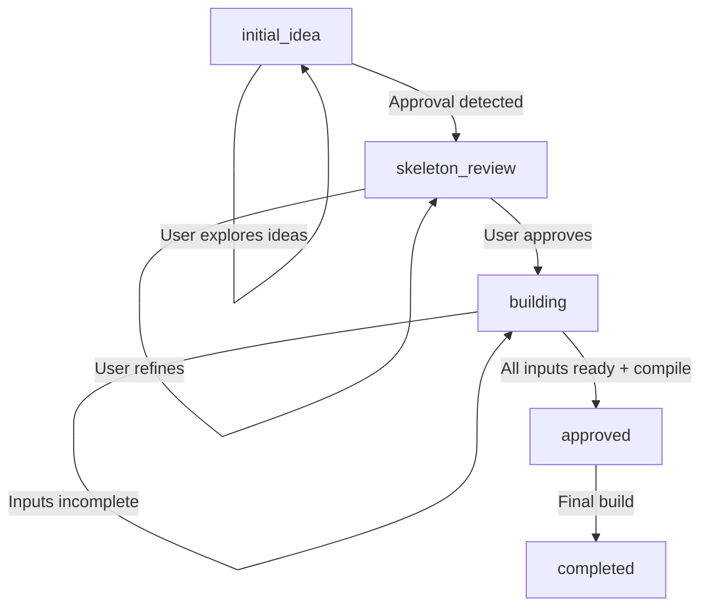

# 🏗️ Agent Builder - Complete Frontend Integration Guide

## 📋 **Overview**

This document provides the **definitive specification** for frontend integration with the Agent Builder's `/ami/collaborate` endpoint. It covers all response structures, state transitions, and required frontend handling to ensure perfect alignment between frontend and backend.

## 🚀 **8-Step Agent Creation Process**

The Agent Builder follows this **exact 8-step process**:

1. **💡 Idea Stage**: User explores ideas with Ami (conversation mode)
2. **🔄 Refinement**: User and Ami refine the blueprint together  
3. **✅ Approval**: User approves the blueprint ("OK. Build it")
4. **🔧 Building Stage**: Ami generates todos for input collection (**NEW**)
5. **📝 Input Collection**: User provides API keys, credentials (**NEW**)
6. **⚡ Compilation**: User says "compile" when inputs are ready (**NEW**)
7. **📦 Final Build**: Everything bundled in Agent Blueprint
8. **🎉 Completed**: Agent is ready to run

---

## 🔌 **API Endpoint**

### **Single Endpoint for All Operations**
```
POST /ami/collaborate
```

**All agent creation phases use this ONE endpoint** - the backend routes based on request content and state.

---

## 📤 **Request Structure**

### **Base Request Format**
```typescript
interface CollaborateRequest {
  user_input: string;                    // Required: User's message
  conversation_id?: string;              // Optional: Chat session ID  
  org_id: string;                        // Required: Organization ID
  user_id: string;                       // Required: User ID
  llm_provider?: string;                 // Optional: "anthropic" | "openai"
  model?: string;                        // Optional: Model name
  current_state?: ConversationState;     // Optional: Current state
  conversation_history?: Message[];      // Optional: Previous messages
  
  // Only include these for refinement/building phases
  agent_id?: string;                     // Agent ID (after creation)
  blueprint_id?: string;                 // Blueprint ID (after creation)
}

type ConversationState = 
  | "initial_idea"      // Exploring ideas
  | "skeleton_review"   // Reviewing blueprint  
  | "building"          // Input collection phase
  | "approved"          // Final compilation
  | "completed";        // Agent ready

interface Message {
  role: "user" | "assistant";
  content: string;
  timestamp: string;
}
```

### **Request Examples by Phase**

#### **Phase 1-2: Conversation/Creation**
```javascript
{
  "user_input": "I need a CEO assistant that reads reports from Google Drive",
  "conversation_id": "conv_1754475157115_me1url7kv",
  "org_id": "org_123",
  "user_id": "user_456",
  "llm_provider": "openai",
  "model": "gpt-4o",
  "conversation_history": [
    {
      "role": "user", 
      "content": "CEO assistant 123", 
      "timestamp": "2025-08-06T10:12:36.950Z"
    }
  ]
  // Note: NO agent_id or blueprint_id yet
}
```

#### **Phase 3: Approval**
```javascript
{
  "user_input": "Ok. Approve. Build it",
  "current_state": "skeleton_review",
  "conversation_id": "conv_1754475157115_me1url7kv",
  "agent_id": "fb300b5b-3180-40c7-a9cd-a9c25e0d1e05",
  "blueprint_id": "d02cd28b-3240-48fd-a72c-8eb86f4efd1e",
  "org_id": "org_123",
  "user_id": "user_456"
}
```

#### **Phase 4-5: Input Collection**
```javascript
{
  "user_input": "I provided the Google Drive API key",
  "current_state": "building",
  "conversation_id": "conv_1754475157115_me1url7kv", 
  "agent_id": "fb300b5b-3180-40c7-a9cd-a9c25e0d1e05",
  "blueprint_id": "d02cd28b-3240-48fd-a72c-8eb86f4efd1e",
  "org_id": "org_123",
  "user_id": "user_456"
}
```

#### **Phase 6: Compilation Request**
```javascript
{
  "user_input": "compile",
  "current_state": "building",
  "agent_id": "fb300b5b-3180-40c7-a9cd-a9c25e0d1e05",
  "blueprint_id": "d02cd28b-3240-48fd-a72c-8eb86f4efd1e",
  "org_id": "org_123",
  "user_id": "user_456"
}
```

---

## 📥 **Response Structure**

### **Base Response Format**
```typescript
interface CollaborateResponse {
  success: boolean;
  conversation_id: string;
  current_state: ConversationState;
  ami_message: string;                   // Markdown-formatted message
  agent_id?: string;                     // Present after creation
  blueprint_id?: string;                 // Present after creation
  data?: ResponseData;                   // Phase-specific data
  next_actions: string[];                // Suggested next steps
  error?: string;                        // Error message if failed
}

interface ResponseData {
  // Varies by phase - see specific examples below
  [key: string]: any;
}
```

---

## 📊 **Response Examples by Phase**

### **Phase 1: Conversation Mode (No Agent Created)**

**Request**: First message exploring ideas
```javascript
{
  "user_input": "CEO assistant 123",
  "conversation_id": "conv_1754475157115_me1url7kv",
  "org_id": "org_123", 
  "user_id": "user_456"
}
```

**Response**:
```javascript
{
  "success": true,
  "conversation_id": "conv_1754475157115_me1url7kv",
  "current_state": "initial_idea",
  "ami_message": "I see that you're interested in creating an AI assistant for a CEO role, I'm excited to help you with this. To better understand your needs, could you please provide more details on the specific tasks you'd like the assistant to handle? Also, what kind of systems or tools are currently used in the CEO's daily workflow that the assistant should be integrated with? Lastly, it would be great to know more about the problem you're trying to solve with this AI assistant.",
  // Note: NO agent_id or blueprint_id - agent not created yet
  "data": {
    "mode": "conversation",
    "phase": "idea_exploration"
  },
  "next_actions": [
    "Provide more details about specific tasks",
    "Describe required integrations", 
    "Explain the problem you're solving"
  ],
  "error": null
}
```

### **Phase 2: Agent Creation (Approval Detected)**

**Request**: User shows readiness to create
```javascript
{
  "user_input": "OK. Create it",
  "conversation_id": "conv_1754475157115_me1url7kv",
  "org_id": "org_123",
  "user_id": "user_456"
}
```

**Response**:
```javascript
{
  "success": true,
  "conversation_id": "conv_1754475157115_me1url7kv", 
  "current_state": "skeleton_review",
  "ami_message": "Great! I've created 'CEO Assistant 123' based on our conversation. The agent is ready to use, and you can refine any details as needed. What would you like to adjust?",
  "agent_id": "fb300b5b-3180-40c7-a9cd-a9c25e0d1e05",      // ✅ NOW PRESENT
  "blueprint_id": "d02cd28b-3240-48fd-a72c-8eb86f4efd1e",  // ✅ NOW PRESENT
  "data": {
    "mode": "created",
    "agent_name": "CEO Assistant 123",
    "agent_type": "assistant", 
    "agent_concept": "An AI assistant designed to manage and streamline a CEO's daily tasks and responsibilities",
    "agent_purpose": "To assist a CEO in their daily tasks and responsibilities",
    "key_tasks": [
      "Scheduling meetings",
      "Managing emails", 
      "Coordinating with other executives",
      "Providing reminders"
    ],
    "integrations": [
      "Email",
      "Calendar", 
      "Task Management Software"
    ],
    "target_users": "CEO",
    "next_phase": "refinement",
    "blueprint_summary": {
      "tasks_count": 4,
      "integrations_count": 3,
      "has_monitoring": true
    },
    "frontend_actions": {
      "load_blueprint": "/org-agents/fb300b5b-3180-40c7-a9cd-a9c25e0d1e05/blueprint",
      "load_agent_details": "/org-agents/fb300b5b-3180-40c7-a9cd-a9c25e0d1e05",
      "suggested_api_calls": [
        {
          "method": "GET",
          "endpoint": "/org-agents/fb300b5b-3180-40c7-a9cd-a9c25e0d1e05/blueprint", 
          "purpose": "Load full blueprint details"
        }
      ]
    }
  },
  "next_actions": [
    "Review CEO Assistant 123's task priorities and capabilities",
    "Add specific integrations for your workflow",
    "Test the agent with sample scenarios", 
    "Preview CEO Assistant 123's full blueprint configuration",
    "Test and approve the agent for production use"
  ],
  "error": null
}
```

### **Phase 3: Blueprint Refinement**

**Request**: User refines the blueprint
```javascript
{
  "user_input": "The assistant will read /reports in google drive",
  "current_state": "skeleton_review",
  "agent_id": "fb300b5b-3180-40c7-a9cd-a9c25e0d1e05",
  "blueprint_id": "d02cd28b-3240-48fd-a72c-8eb86f4efd1e",
  "conversation_id": "conv_1754475157115_me1url7kv"
}
```

**Response**:
```javascript
{
  "success": true,
  "conversation_id": "conv_1754475157115_me1url7kv",
  "current_state": "skeleton_review",
  "ami_message": "Perfect! I've enhanced **CEO Assistant 123** based on your feedback.\n\n**Changes made to your general agent:**\n✅ Added 'Reading reports' as a new task in capabilities with the description of reading and extracting information from reports stored in Google Drive.\n✅ Integrated Google Drive to support the new task of reading reports, allowing document management and information extraction.\n\n**Updated Status:**\n📊 **Blueprint Completeness**: 0% → 0%\n🎯 **Current Focus**: basic capabilities\n\n**I have some smart questions to make CEO Assistant 123 even better:**\n❓ Are there specific types of reports the CEO Assistant 123 should focus on?\n❓ Should the assistant provide summaries or analytics based on the reports it reads?\n\nWhat do you think? Ready to compile CEO Assistant 123, or would you like to refine further?",
  "agent_id": "fb300b5b-3180-40c7-a9cd-a9c25e0d1e05",
  "blueprint_id": "d02cd28b-3240-48fd-a72c-8eb86f4efd1e",
  "data": {
    "agent_id": "fb300b5b-3180-40c7-a9cd-a9c25e0d1e05",
    "blueprint_id": "d02cd28b-3240-48fd-a72c-8eb86f4efd1e",
    "changes_made": [
      "Added 'Reading reports' as a new task in capabilities with the description of reading and extracting information from reports stored in Google Drive.",
      "Integrated Google Drive to support the new task of reading reports, allowing document management and information extraction."
    ],
    "updated_blueprint": {
      "identity": {
        "name": "CEO Assistant 123",
        "type": "assistant",
        "purpose": "To assist a CEO in their daily tasks and responsibilities",
        "language": "english"
      },
      "capabilities": {
        "tasks": [
          {
            "task": "Reading reports",
            "description": "Ability to read and extract information from reports stored in Google Drive"
          }
        ],
        "integrations": [
          {
            "tool": "Google Drive", 
            "purpose": "Read and manage documents"
          }
        ]
      }
    }
  },
  "next_actions": [
    "Compile CEO Assistant 123",
    "Make more refinements", 
    "Ask questions about the updates",
    "Review agent capabilities"
  ],
  "error": null
}
```

### **Phase 4: Approval → Input Collection (NEW)**

**Request**: User approves blueprint
```javascript
{
  "user_input": "Ok. Approve. Build it",
  "current_state": "skeleton_review",
  "agent_id": "fb300b5b-3180-40c7-a9cd-a9c25e0d1e05",
  "blueprint_id": "d02cd28b-3240-48fd-a72c-8eb86f4efd1e",
  "conversation_id": "conv_1754475157115_me1url7kv"
}
```

**Response**: **🚨 NEW RESPONSE - BUILDING STATE**
```javascript
{
  "success": true,
  "conversation_id": "conv_1754475157115_me1url7kv",
  "current_state": "building",                    // ⚠️ NEW STATE
  "ami_message": "🎉 Great! I've approved **CEO Assistant 123** and created the blueprint!\n\n**Now I need some information to set up the integrations:**\n\n✅ **Agent Blueprint**: Created and ready\n✅ **Implementation Todos**: 3 tasks generated\n\n**Next Steps (Steps 4-5):**\n1. **Review the todos** - I've analyzed what integrations and configurations are needed\n2. **Provide required information** - API keys, credentials, and configuration details\n3. **Complete setup tasks** - Follow the guided steps for each integration\n\n**Once you provide the required information, I'll compile everything into your production-ready agent!**\n\nWhich todo would you like to start with?",
  "agent_id": "fb300b5b-3180-40c7-a9cd-a9c25e0d1e05",
  "blueprint_id": "d02cd28b-3240-48fd-a72c-8eb86f4efd1e",
  "data": {
    "agent_id": "fb300b5b-3180-40c7-a9cd-a9c25e0d1e05",
    "blueprint_id": "d02cd28b-3240-48fd-a72c-8eb86f4efd1e",
    "agent_name": "CEO Assistant 123",
    "phase": "input_collection",                   // ⚠️ NEW PHASE
    "todos_generated": 3,
    "implementation_todos": [                      // ⚠️ NEW TODO STRUCTURE
      {
        "id": "todo_1",
        "title": "Connect to Google Drive",
        "description": "Set up Google Drive integration for reading reports from /reports folder",
        "category": "integration",
        "priority": "high", 
        "status": "pending",
        "estimated_effort": "5-10 minutes",
        "input_required": {                        // ⚠️ INPUT COLLECTION FIELDS
          "type": "google_drive_credentials",
          "fields": [
            {
              "name": "google_drive_api_key",
              "type": "string",
              "required": true,
              "description": "Google Drive API key from Google Cloud Console"
            },
            {
              "name": "service_account_json", 
              "type": "text",
              "required": true,
              "description": "Service account JSON file content for Google Drive access"
            },
            {
              "name": "folder_path",
              "type": "string", 
              "required": false,
              "description": "Specific folder path to monitor",
              "default": "/reports"
            }
          ]
        },
        "collected_inputs": {},                    // Will be populated when user provides inputs
        "created_at": "2025-08-06T10:13:45.123Z"
      },
      {
        "id": "todo_2", 
        "title": "Configure Email Integration",
        "description": "Set up email integration for CEO communication",
        "category": "integration",
        "priority": "medium",
        "status": "pending",
        "input_required": {
          "type": "email_credentials",
          "fields": [
            {
              "name": "email_provider",
              "type": "select",
              "required": true,
              "description": "Email service provider",
              "options": ["gmail", "outlook", "custom_smtp"]
            }
          ]
        },
        "collected_inputs": {}
      }
    ],
    "next_step": "collect_inputs",
    "completion_status": "todos_pending"
  },
  "next_actions": [
    "Review implementation todos",
    "Provide required API keys and credentials",
    "Complete integration setup tasks", 
    "Compile agent once all inputs are collected"
  ],
  "error": null
}
```

### **Phase 5: Input Collection Interaction**

**Request**: User provides input or asks about todos
```javascript
{
  "user_input": "How do I get the Google Drive API key?",
  "current_state": "building",
  "agent_id": "fb300b5b-3180-40c7-a9cd-a9c25e0d1e05",
  "blueprint_id": "d02cd28b-3240-48fd-a72c-8eb86f4efd1e",
  "conversation_id": "conv_1754475157115_me1url7kv"
}
```

**Response**:
```javascript
{
  "success": true,
  "conversation_id": "conv_1754475157115_me1url7kv",
  "current_state": "building",
  "ami_message": "Great! I'm ready to help you set up **CEO Assistant 123**.\n\n**Current Status:**\n✅ Blueprint approved and created\n📋 3 implementation todos generated\n⏳ 2 todos pending completion\n\n**Next Steps:**\n1. Complete the implementation todos by providing required information\n2. Once all todos are done, say 'compile' to build your final agent\n\nWhich todo would you like to work on first?",
  "agent_id": "fb300b5b-3180-40c7-a9cd-a9c25e0d1e05",
  "blueprint_id": "d02cd28b-3240-48fd-a72c-8eb86f4efd1e", 
  "data": {
    "todos": [/* full todo list */],
    "pending_todos": [/* pending todos only */],
    "phase": "input_collection"
  },
  "next_actions": [
    "Complete implementation todos",
    "Provide API keys and credentials",
    "Say 'compile' when ready to build final agent"
  ],
  "error": null
}
```

### **Phase 6: Compilation Request (Inputs Not Ready)**

**Request**: User tries to compile but inputs incomplete
```javascript
{
  "user_input": "compile",
  "current_state": "building",
  "agent_id": "fb300b5b-3180-40c7-a9cd-a9c25e0d1e05",
  "blueprint_id": "d02cd28b-3240-48fd-a72c-8eb86f4efd1e"
}
```

**Response**:
```javascript
{
  "success": true,
  "conversation_id": "conv_1754475157115_me1url7kv",
  "current_state": "building",                    // Still building
  "ami_message": "I'd love to compile **CEO Assistant 123** for you! However, I still need some information to complete the setup.\n\n**Pending todos:** 2 remaining\n\nPlease provide the required inputs for the pending todos, then I can compile your agent.",
  "agent_id": "fb300b5b-3180-40c7-a9cd-a9c25e0d1e05",
  "blueprint_id": "d02cd28b-3240-48fd-a72c-8eb86f4efd1e",
  "data": {
    "pending_todos": [/* list of incomplete todos */],
    "completion_status": "inputs_pending"
  },
  "next_actions": [
    "Complete pending todos",
    "Provide required API keys and credentials", 
    "Try compiling again once inputs are provided"
  ],
  "error": null
}
```

### **Phase 7-8: Final Compilation (All Inputs Ready)**

**Request**: User compiles with all inputs provided
```javascript
{
  "user_input": "compile", 
  "current_state": "building",
  "agent_id": "fb300b5b-3180-40c7-a9cd-a9c25e0d1e05",
  "blueprint_id": "d02cd28b-3240-48fd-a72c-8eb86f4efd1e"
}
```

**Response**:
```javascript
{
  "success": true,
  "conversation_id": "conv_1754475157115_me1url7kv",
  "current_state": "completed",                   // ✅ FINALLY COMPLETED
  "ami_message": "🎉 Excellent! I've successfully compiled and activated **CEO Assistant 123**!\n\n**Your general agent is now production-ready:**\n✅ **Identity**: CEO Assistant 123 - Agent created from conversation: An AI assistant designed to manage and streamline a CEO's daily tasks and responsibilities\n✅ **Capabilities**: basic capabilities\n✅ **Knowledge Sources**: 0 configured\n✅ **Integrations**: 0 connected\n✅ **Blueprint Completeness**: 0%\n✅ **System Prompt**: Generated and compiled\n\n**CEO Assistant 123 is now live and ready to help users!** The compiled blueprint contains all our collaborative refinements and is optimized for english communication.",
  "agent_id": "fb300b5b-3180-40c7-a9cd-a9c25e0d1e05",
  "blueprint_id": "d02cd28b-3240-48fd-a72c-8eb86f4efd1e",
  "data": {
    "agent_id": "fb300b5b-3180-40c7-a9cd-a9c25e0d1e05",
    "blueprint_id": "d02cd28b-3240-48fd-a72c-8eb86f4efd1e", 
    "compilation_status": "compiled",
    "activation_status": "active",
    "context": {
      "agent_identity": {
        "name": "CEO Assistant 123",
        "purpose": "Agent created from conversation: An AI assistant designed to manage and streamline a CEO's daily tasks and responsibilities",
        "type": "general",
        "language": "english"
      }
    }
  },
  "next_actions": [
    "Start using CEO Assistant 123",
    "Test agent responses",
    "Create another agent", 
    "Monitor agent performance"
  ],
  "error": null
}
```

---

## 🔄 **State Transition Flow**



### **State Descriptions**

| State | Description | Frontend Action |
|-------|-------------|-----------------|
| `initial_idea` | Exploring ideas, no agent created | Show conversation UI |
| `skeleton_review` | Agent created, refining blueprint | Show refinement UI |
| `building` | Input collection phase | **Show todo collection UI** |
| `approved` | Final compilation in progress | Show loading/building |
| `completed` | Agent ready for use | Show success + agent details |

---

## 🚨 **Critical Frontend Requirements**

### **1. State-Based Routing**
```javascript
const handleResponse = (response) => {
  switch (response.current_state) {
    case 'initial_idea':
      showConversationInterface();
      break;
    case 'skeleton_review': 
      showRefinementInterface();
      break;
    case 'building':                    // ⚠️ NEW STATE
      showTodoCollectionInterface(response.data.implementation_todos);
      break;
    case 'completed':
      showSuccessInterface();
      break;
  }
};
```

### **2. ID Management**
```javascript
// Always save these when they appear in responses
if (response.agent_id) {
  sessionStorage.setItem('agent_id', response.agent_id);
}
if (response.blueprint_id) {
  sessionStorage.setItem('blueprint_id', response.blueprint_id);
}

// Always include in subsequent requests
const makeRequest = (userInput) => ({
  user_input: userInput,
  agent_id: sessionStorage.getItem('agent_id'),
  blueprint_id: sessionStorage.getItem('blueprint_id'),
  current_state: sessionStorage.getItem('current_state')
});
```

### **3. Todo Collection UI**
```jsx
const TodoCollectionInterface = ({ todos }) => {
  return (
    <div className="todo-collection">
      <h2>🔧 Setup Your Agent</h2>
      <p>Please provide the following information:</p>
      
      {todos.map(todo => (
        <TodoCard key={todo.id} todo={todo} />
      ))}
      
      <button 
        onClick={() => sendMessage("compile")}
        disabled={!allTodosComplete()}
      >
        🚀 Compile Agent
      </button>
    </div>
  );
};
```

---

## ⚠️ **Breaking Changes from Previous Version**

### **What Changed**
1. **Approval no longer completes immediately** - now goes to `building` state
2. **New `building` state** requires frontend handling
3. **Todo collection phase** must be implemented
4. **Compilation is manual** - user must say "compile"

### **Migration Required**
- **Update state handling** to include `building` state
- **Add todo collection UI** for input gathering
- **Change completion detection** from approval to `completed` state
- **Handle input validation** for API keys and credentials

---

## 🧪 **Testing Scenarios**

### **Complete Flow Test**
```javascript
// 1. Start conversation
await sendMessage("CEO assistant for Vietnamese market");
// Expect: current_state = "initial_idea"

// 2. Provide details  
await sendMessage("It should read reports from Google Drive");
// Expect: current_state = "initial_idea" (still exploring)

// 3. Approve creation
await sendMessage("OK. Create it");  
// Expect: current_state = "skeleton_review", agent_id + blueprint_id present

// 4. Refine blueprint
await sendMessage("Add email integration");
// Expect: current_state = "skeleton_review", changes_made in data

// 5. Approve blueprint
await sendMessage("Approve and build");
// Expect: current_state = "building", implementation_todos present

// 6. Try to compile (should fail)
await sendMessage("compile");
// Expect: current_state = "building", pending_todos in response

// 7. Provide inputs (implementation depends on todo completion API)
// ... complete todos ...

// 8. Final compilation
await sendMessage("compile");
// Expect: current_state = "completed", agent ready
```

---

## 📞 **Support & Questions**

For any frontend integration questions or response structure clarifications:

1. **Check this document first** - all response structures are documented
2. **Test with the exact request formats** shown above
3. **Always include required fields** (`user_input`, `org_id`, `user_id`)
4. **Handle all state transitions** shown in the flow diagram

**The backend guarantees these exact response structures** - any deviation should be reported as a bug.