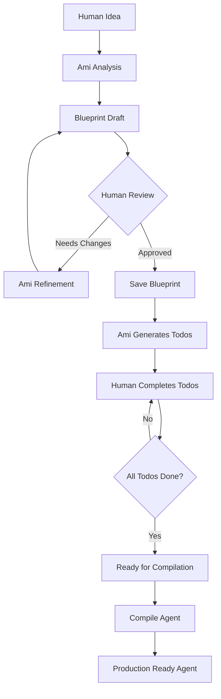

# 🏗️ Agent Builder with Blueprint - Complete Frontend Integration Guide

## 📋 **Overview**

This guide provides complete frontend integration documentation for the **8-Step Agent Builder with Blueprint Architecture**. The system enables users to create production-ready AI agents through an intelligent, guided process.

## 🚨 **CRITICAL UPDATE: Complete 7-Part Blueprint Structure**

**⚠️ BREAKING CHANGE:** Ami now generates complete human-friendly agent blueprints following the 7-part Agent Pitch structure, not just technical specifications.

### **What Changed:**
- **Response field changed:** `agent_skeleton` → `agent_blueprint`  
- **Complete 7-part structure:** Includes Meet Me, What I Do, Knowledge Sources, Integrations, Monitoring, Test Scenarios, and Workflow
- **Human-friendly format:** Sample conversations, specific triggers/actions, fallback behaviors
- **Richer UI components:** Frontend can now display full agent personalities and workflows

### **Key Benefits for Users:**
- **Immediate understanding:** Users see exactly how their agent will behave
- **Test scenarios:** Sample Q&A helps users validate agent responses  
- **Visual workflows:** Clear step-by-step process visualization
- **Real integrations:** Specific app connections with triggers and actions

### **Complete 8-Step Flow:**
1. **Idea Stage** - Human shares idea, Ami helps build blueprint
2. **Refinement** - Human and Ami iterate on blueprint design  
3. **Approval** - Human decides to save approved blueprint
4. **Todo Generation** - Ami analyzes blueprint and generates implementation todos
5. **Input Collection** - Human provides required information and credentials
6. **Compilation Ready** - System validates all requirements met
7. **Compilation** - Everything bundled into agent system prompt
8. **Production Ready** - Agent ready to run with full configuration

---

## 🎨 **Recommended UX Approach: Idea-First with Hybrid Options**

### **Primary User Experience (85% of users)**
**Start with idea → Full Ami collaboration → Production-ready agent**

This approach maximizes user success by:
- ✅ **Immediate value demonstration** - Users see Ami's intelligence from first interaction
- ✅ **Quality guarantee** - Every agent goes through comprehensive process  
- ✅ **Better onboarding** - Guided experience educates users about possibilities
- ✅ **Single cohesive flow** - Natural conversation from idea to completion

### **Secondary Options (15% of users)**
- **Quick Setup** - For power users who want basic agent + optional Ami enhancement
- **Template Import** - For enterprise users with existing blueprints
- **Advanced Creation** - Direct API access for developers

### **User Persona Targeting:**

#### **🆕 First-Time Users (70%): Idea-First Flow**
- Need guidance and education about agent capabilities
- Benefit from full collaborative experience with Ami
- Want to see what's possible before making decisions

#### **⚡ Power Users (20%): Quick Setup + Enhancement**  
- Know what they want, prefer control
- Might start basic then enhance with Ami
- Appreciate flexibility and speed

#### **🏢 Enterprise Users (10%): Template Import**
- Have existing agent blueprints or templates
- Need to deploy standardized agents quickly
- Require bulk creation capabilities

---

## 🚀 **Landing Page UX Implementation**

### **Primary Landing Page (Idea-First Approach)**

```jsx
const AgentBuilderLanding = () => {
  const [userIdea, setUserIdea] = useState('');
  const [showAdvancedOptions, setShowAdvancedOptions] = useState(false);
  
  return (
    <div className="agent-builder-landing">
      <div className="hero-section">
        <div className="ami-introduction">
          <div className="ami-avatar">🧠</div>
          <h1>Meet Ami, Your AI Assistant</h1>
          <p className="ami-description">
            "I'll help you build the perfect AI agent through a guided, 
            intelligent process. Just tell me your idea!"
          </p>
        </div>
        
        <div className="idea-input-section">
          <h2>What kind of agent do you want to build?</h2>
          <textarea
            value={userIdea}
            onChange={(e) => setUserIdea(e.target.value)}
            placeholder="Describe your agent idea...

Examples:
• Sales agent for Vietnamese market with Gmail integration
• Customer support bot that speaks French and Spanish  
• Research assistant for medical papers with citation tracking
• Personal scheduling agent with calendar and email access"
            rows={4}
            className="idea-input"
          />
          
          <button 
            className="primary-cta"
            onClick={() => startAmiCollaboration(userIdea)}
            disabled={userIdea.length < 10}
          >
            🚀 Start Building with Ami
          </button>
          
          <div className="value-props">
            <div className="prop">✨ Intelligent design guidance</div>
            <div className="prop">🔧 Automated setup assistance</div>
            <div className="prop">🎯 Production-ready results</div>
          </div>
        </div>
      </div>
      
      <div className="advanced-options">
        <button 
          className="secondary-link"
          onClick={() => setShowAdvancedOptions(!showAdvancedOptions)}
        >
          Need something specific? {showAdvancedOptions ? '▼' : '▶'} Advanced options
        </button>
        
        {showAdvancedOptions && (
          <div className="advanced-methods">
            <div className="method-card">
              <h3>⚡ Quick Setup</h3>
              <p>Create basic agent first, enhance with Ami later</p>
              <button onClick={() => navigate('/agent-builder/quick')}>
                Quick Create
              </button>
            </div>
            
            <div className="method-card">
              <h3>📋 Import Blueprint</h3>
              <p>Use existing agent template or blueprint</p>
              <button onClick={() => navigate('/agent-builder/import')}>
                Import Template
              </button>
            </div>
            
            <div className="method-card">
              <h3>🔧 Developer Mode</h3>
              <p>Direct API access for custom integration</p>
              <button onClick={() => navigate('/docs/api')}>
                View API Docs
              </button>
            </div>
          </div>
        )}
      </div>
    </div>
  );
};
```

### **Progress Indicator Component**

```jsx
const AmiProgressIndicator = ({ currentStep, totalSteps = 8, stepName }) => {
  const steps = [
    'Understanding',
    'Refinement', 
    'Approval',
    'Todo Generation',
    'Input Collection',
    'Ready to Compile',
    'Compilation',
    'Production Ready'
  ];
  
  return (
    <div className="ami-progress">
      <div className="progress-header">
        <h3>Building with Ami</h3>
        <span className="step-counter">Step {currentStep} of {totalSteps}</span>
      </div>
      
      <div className="progress-bar">
        <div 
          className="progress-fill"
          style={{ width: `${(currentStep / totalSteps) * 100}%` }}
        />
      </div>
      
      <div className="current-step">
        <span className="step-name">{stepName}</span>
        <span className="step-description">{steps[currentStep - 1]}</span>
      </div>
      
      <div className="steps-overview">
        {steps.map((step, index) => (
          <div 
            key={index}
            className={`step-dot ${index < currentStep ? 'completed' : ''} ${index === currentStep - 1 ? 'active' : ''}`}
          >
            {index < currentStep - 1 ? '✓' : index + 1}
          </div>
        ))}
      </div>
    </div>
  );
};
```

---

## 🔧 **Alternative Creation Methods (Secondary Options)**

### **Quick Setup Endpoint (For Power Users)**

```javascript
// Simple Ami-powered creation without collaboration
const createAgentQuick = async (description) => {
  const response = await fetch('/ami/create-agent', {
    method: 'POST',
    headers: {
      'Content-Type': 'application/json',
      'Authorization': `Bearer ${userToken}`
    },
    body: JSON.stringify({
      user_request: description,
      llm_provider: "anthropic",
      model: "claude-3-5-sonnet-20241022" // optional
    })
  });
  
  return response.json();
};

// Response structure
{
  "success": true,
  "agent_id": "agent_123",
  "agent_name": "Vietnamese Sales Assistant", 
  "message": "✅ Agent created successfully",
  "agent_config": {
    "system_prompt": "You are a Vietnamese Sales Assistant...",
    "tools": ["gmail", "calendar"],
    "capabilities": ["sales_assistance", "language_processing"]
  }
}
```

### **Basic Agent Shell (Manual Configuration)**

```javascript
// Create empty agent for manual configuration
const createBasicAgent = async (name, description) => {
  const response = await fetch('/org-agents/', {
    method: 'POST',
    headers: {
      'Content-Type': 'application/json',
      'Authorization': `Bearer ${userToken}`
    },
    body: JSON.stringify({
      name: name,
      description: description
    })
  });
  
  return response.json();
};
```

### **Blueprint Import (Enterprise Use)**

```javascript
// Import existing blueprint
const importAgentBlueprint = async (name, blueprintData, conversationId) => {
  const response = await fetch('/org-agents/with-blueprint', {
    method: 'POST',
    headers: {
      'Content-Type': 'application/json',
      'Authorization': `Bearer ${userToken}`
    },
    body: JSON.stringify({
      name: name,
      description: "Agent created from imported blueprint",
      agent_blueprint: blueprintData,
      conversation_id: conversationId
    })
  });
  
  return response.json();
};
```

---

## 🎯 **Architecture Overview**



---

## 🚀 **Step-by-Step Implementation Guide**

### **Step 1-3: Blueprint Creation & Refinement**

#### **Start Collaborative Agent Creation**

**Endpoint:** `POST /ami/collaborate`

**Request:**
```javascript
const startAgentCreation = async (userIdea) => {
  const response = await fetch('/ami/collaborate', {
    method: 'POST',
    headers: {
      'Content-Type': 'application/json',
      'Authorization': `Bearer ${userToken}`
    },
    body: JSON.stringify({
      user_input: userIdea,
      conversation_id: generateConversationId(),
      org_id: currentOrgId,
      user_id: currentUserId,
      llm_provider: "anthropic" // or "openai"
    })
  });
  
  return response.json();
};

// Example usage
const result = await startAgentCreation(
  "Create a sales agent for Vietnamese market with Gmail integration"
);
```

**Response Structure:**
```json
{
  "success": true,
  "state": "understanding",
  "ami_message": "I understand you want a Vietnamese sales agent with Gmail. Let me ask some clarifying questions...",
  "clarifying_questions": [
    "What specific sales processes should this agent handle?",
    "Do you need CRM integration beyond Gmail?",
    "What Vietnamese business practices should it follow?"
  ],
  "agent_blueprint": {
    "agent_name": "Vietnamese Sales Assistant",
    "agent_purpose": "Sales agent for Vietnamese market targeting TikTok cross-selling",
    "target_users": "Sales team targeting Vietnamese clients",
    "agent_type": "sales",
    "language": "vietnamese",
    "meet_me": {
      "introduction": "Hi, I'm Vietnamese Sales Assistant! My main job is helping you find perfect product pairs for your TikTok shop. I'm here to boost your cross-selling success!",
      "value_proposition": "Think of me as your sales data detective that spots profitable product combinations."
    },
    "what_i_do": {
      "primary_tasks": [
        {"task": "Analyze TikTok sales data", "description": "I examine your shop performance to identify trending products"},
        {"task": "Find product pairs", "description": "I spot which items sell well together"},
        {"task": "Recommend cross-sells", "description": "I suggest the best product combinations for higher sales"}
      ],
      "personality": {
        "tone": "friendly",
        "style": "analytical",
        "analogy": "like a data-savvy sales buddy who speaks Vietnamese"
      },
      "sample_conversation": {
        "user_question": "What should I bundle with wireless earbuds?",
        "agent_response": "Great choice! Wireless earbuds sell amazingly with phone cases (67% buy both) and portable chargers (52% combo rate). Want me to check your TikTok trends for this week?"
      }
    },
    "knowledge_sources": [
      {
        "source": "TikTok Shop Analytics Dashboard",
        "type": "api",
        "update_frequency": "hourly",
        "content_examples": ["sales data", "product performance", "customer behavior"]
      }
    ],
    "integrations": [
      {
        "app_name": "TikTok Shop API",
        "trigger": "When analyzing product performance",
        "action": "I fetch real-time sales and engagement data"
      },
      {
        "app_name": "Slack",
        "trigger": "When I find hot cross-selling opportunities",
        "action": "I send alerts to your sales team"
      }
    ],
    "monitoring": {
      "reporting_method": "Weekly cross-selling performance reports via email",
      "metrics_tracked": ["cross-sell conversion rates", "average order value", "product pair performance"],
      "fallback_response": "Let me double-check that data for you!",
      "escalation_method": "I'll ping your team on Slack for complex requests"
    },
    "test_scenarios": [
      {
        "question": "What's trending with phone accessories?",
        "expected_response": "Phone grips are hot right now! They pair perfectly with your clear cases - 45% conversion rate. Want me to analyze this week's TikTok trends?"
      }
    ],
    "workflow_steps": [
      "You ask about product pairing or trends",
      "I analyze your TikTok Shop data in real-time", 
      "I identify top-performing product combinations",
      "I provide recommendations with confidence scores and reasoning",
      "I track results for future optimization"
    ],
    "visual_flow": "User Question → TikTok Data Analysis → Product Pairing Algorithm → Recommendations with Metrics → Performance Tracking"
  },
  "conversation_id": "conv_123",
  "next_action": "REFINE_BLUEPRINT"
}
```

#### **Refine Blueprint (Steps 1-2 Loop)**

**Continue the conversation until approval:**

```javascript
const refineBlueprint = async (userFeedback, conversationId) => {
  const response = await fetch('/ami/collaborate', {
    method: 'POST',
    headers: {
      'Content-Type': 'application/json',
      'Authorization': `Bearer ${userToken}`
    },
    body: JSON.stringify({
      user_input: userFeedback,
      conversation_id: conversationId,
      org_id: currentOrgId,
      user_id: currentUserId,
      llm_provider: "anthropic"
    })
  });
  
  return response.json();
};

// Example refinement loop
let approved = false;
let conversationId = "conv_123";

while (!approved) {
  const userFeedback = await getUserFeedback(); // Get user input from UI
  const result = await refineBlueprint(userFeedback, conversationId);
  
  if (result.state === "approved") {
    approved = true;
    // Move to Step 3: Save Blueprint
  } else {
    // Show updated blueprint and ask for more feedback
    displayBlueprint(result.agent_blueprint);
    displayQuestions(result.clarifying_questions);
  }
}
```

#### **Save Approved Blueprint (Step 3)**

**When user approves, the system automatically:**
- Saves the blueprint to database
- Generates intelligent implementation todos
- Returns agent ID and todo list

```javascript
// The approval response includes everything needed for next steps
const approvalResponse = {
  "success": true,
  "state": "building",
  "ami_message": "🎉 Perfect! I've created 'Vietnamese Sales Assistant' with comprehensive Agent Architecture!",
  "data": {
    "agent_id": "agent_abc123",
    "blueprint_id": "blueprint_def456", 
    "todos_generated": 4,
    "implementation_todos": [
      {
        "id": "todo_1",
        "title": "Configure Gmail Integration for Vietnamese Sales Communication",
        "description": "Set up Gmail API with OAuth2 for personalized sales emails in Vietnamese",
        "category": "tool_configuration",
        "priority": "high",
        "status": "pending",
        "input_required": {
          "type": "gmail_credentials",
          "fields": [
            {
              "name": "gmail_api_key",
              "type": "string",
              "required": true,
              "description": "Gmail API key from Google Console with Gmail API enabled"
            },
            {
              "name": "client_secret", 
              "type": "password",
              "required": true,
              "description": "OAuth 2.0 Client Secret"
            }
          ]
        },
        "tool_instructions": {
          "tool_name": "Gmail API",
          "how_to_call": "Use Gmail API v1 with OAuth2 authentication",
          "when_to_use": "When sending follow-up emails, scheduling meetings",
          "expected_output": "Successful email delivery with Vietnamese formatting"
        }
      }
      // ... more todos
    ]
  },
  "next_actions": [
    "Complete implementation todos to configure the agent",
    "Compile blueprint once all todos are completed"
  ]
};
```

---

### **Step 4-5: Todo Management & Input Collection**

#### **Display Todos to User**

**Get todos for a blueprint:**

```javascript
const getTodos = async (agentId, blueprintId) => {
  const response = await fetch(
    `/org-agents/${agentId}/blueprints/${blueprintId}/todos`,
    {
      headers: {
        'Authorization': `Bearer ${userToken}`
      }
    }
  );
  
  return response.json();
};

// Response structure
const todosResponse = {
  "todos": [
    {
      "id": "todo_1",
      "title": "Configure Gmail Integration for Vietnamese Sales Communication",
      "description": "Set up Gmail API with OAuth2 for personalized sales emails",
      "category": "tool_configuration",
      "priority": "high",
      "status": "pending",
      "input_required": {
        "type": "gmail_credentials", 
        "fields": [
          {
            "name": "gmail_api_key",
            "type": "string",
            "required": true,
            "description": "Gmail API key from Google Console"
          }
        ]
      }
    }
  ],
  "statistics": {
    "total": 4,
    "completed": 0,
    "in_progress": 0,
    "pending": 4,
    "completion_percentage": 0
  }
};
```

#### **Validate User Inputs (Optional but Recommended)**

```javascript
const validateTodoInputs = async (agentId, blueprintId, todoId, inputs) => {
  const response = await fetch(
    `/org-agents/${agentId}/blueprints/${blueprintId}/todos/${todoId}/validate-inputs`,
    {
      method: 'POST',
      headers: {
        'Content-Type': 'application/json',
        'Authorization': `Bearer ${userToken}`
      },
      body: JSON.stringify({
        provided_inputs: inputs
      })
    }
  );
  
  return response.json();
};

// Example validation
const validation = await validateTodoInputs(
  "agent_abc123", 
  "blueprint_def456", 
  "todo_1",
  {
    "gmail_api_key": "AIzaSyDjH3k...",
    "client_secret": "GOCSPX-xyz123..."
  }
);

// Validation response
{
  "valid": true,
  "errors": [],
  "todo_id": "todo_1"
}
```

#### **Submit Todo Inputs**

```javascript
const submitTodoInputs = async (agentId, blueprintId, todoId, inputs) => {
  const response = await fetch(
    `/org-agents/${agentId}/blueprints/${blueprintId}/todos/${todoId}/collect-inputs`,
    {
      method: 'POST',
      headers: {
        'Content-Type': 'application/json',
        'Authorization': `Bearer ${userToken}`
      },
      body: JSON.stringify({
        collected_inputs: inputs
      })
    }
  );
  
  return response.json();
};

// Example submission
const result = await submitTodoInputs(
  "agent_abc123",
  "blueprint_def456", 
  "todo_1",
  {
    "gmail_api_key": "AIzaSyDjH3k...",
    "client_id": "123456789-abc.apps.googleusercontent.com",
    "client_secret": "GOCSPX-xyz123...",
    "authorized_domains": "mycompany.com"
  }
);

// Success response
{
  "message": "Inputs collected and todo completed successfully. All todos completed! Blueprint is now ready for compilation.",
  "todo_id": "todo_1",
  "status": "completed",
  "inputs_collected": 4,
  "all_todos_completed": true
}
```

#### **Track Progress**

```javascript
const getProgress = async (agentId, blueprintId) => {
  const todosResponse = await getTodos(agentId, blueprintId);
  
  return {
    totalTodos: todosResponse.statistics.total,
    completedTodos: todosResponse.statistics.completed,
    percentage: todosResponse.statistics.completion_percentage,
    isReadyForCompilation: todosResponse.statistics.completion_percentage === 100
  };
};
```

---

### **Step 6-7: Compilation**

#### **Check Compilation Readiness**

```javascript
const getBlueprint = async (agentId, blueprintId) => {
  const response = await fetch(
    `/org-agents/${agentId}/blueprints/${blueprintId}`,
    {
      headers: {
        'Authorization': `Bearer ${userToken}`
      }
    }
  );
  
  return response.json();
};

// Check if ready for compilation
const blueprint = await getBlueprint("agent_abc123", "blueprint_def456");
const canCompile = blueprint.compilation_status === "ready_for_compilation";
```

#### **Compile Blueprint**

```javascript
const compileBlueprint = async (agentId, blueprintId) => {
  const response = await fetch(
    `/org-agents/${agentId}/blueprints/${blueprintId}/compile`,
    {
      method: 'POST',
      headers: {
        'Authorization': `Bearer ${userToken}`
      }
    }
  );
  
  return response.json();
};

// Example compilation
const compilationResult = await compileBlueprint("agent_abc123", "blueprint_def456");

// Success response
{
  "success": true,
  "blueprint": {
    "id": "blueprint_def456",
    "compilation_status": "compiled",
    "compiled_at": "2024-01-15T14:30:00Z",
    "compiled_system_prompt": "You are Vietnamese Sales Assistant...\n\n# INTEGRATION CONFIGURATIONS\n- Gmail Connection\n  client_id: 123456789-abc.apps.googleusercontent.com\n  gmail_api_key: [CONFIGURED]\n\n# TOOL USAGE INSTRUCTIONS\n## Gmail API\n**How to call:** Use Gmail API v1 with OAuth2 authentication..."
  },
  "message": "Blueprint compiled successfully. Agent is ready for production use."
}
```

---

### **Step 8: Agent Ready for Production**

```javascript
const getCompiledAgent = async (agentId) => {
  const response = await fetch(`/org-agents/${agentId}`, {
    headers: {
      'Authorization': `Bearer ${userToken}`
    }
  });
  
  return response.json();
};

// Agent is now ready with:
// ✅ Complete system prompt with all configurations
// ✅ Working tool integrations with credentials
// ✅ Domain knowledge and cultural context
// ✅ Tool usage instructions
// ✅ Production-ready configuration
```

---

## 🎨 **Frontend UI Implementation Guide**

### **Recommended UI Flow**

#### **1. Agent Idea Input (Step 1)**
```jsx
const AgentIdeaForm = () => {
  const [idea, setIdea] = useState('');
  const [loading, setLoading] = useState(false);
  
  const handleSubmit = async (e) => {
    e.preventDefault();
    setLoading(true);
    
    try {
      const result = await startAgentCreation(idea);
      // Navigate to blueprint refinement
      navigate('/agent-builder/refine', { state: { result } });
    } catch (error) {
      showError('Failed to start agent creation');
    } finally {
      setLoading(false);
    }
  };
  
  return (
    <form onSubmit={handleSubmit}>
      <h2>🤖 What kind of agent do you want to create?</h2>
      <textarea
        value={idea}
        onChange={(e) => setIdea(e.target.value)}
        placeholder="Describe your agent idea... (e.g., 'Create a sales agent for Vietnamese market with Gmail integration')"
        rows={4}
        required
      />
      <button type="submit" disabled={loading}>
        {loading ? 'Ami is analyzing...' : 'Start Building with Ami 🚀'}
      </button>
    </form>
  );
};
```

#### **2. Blueprint Refinement (Steps 2-3)**
```jsx
const BlueprintRefinement = () => {
  const [conversation, setConversation] = useState(null);
  const [userInput, setUserInput] = useState('');
  const [loading, setLoading] = useState(false);
  
  const handleRefinement = async () => {
    setLoading(true);
    
    try {
      const result = await refineBlueprint(userInput, conversation.conversation_id);
      setConversation(result);
      setUserInput('');
      
      if (result.state === 'approved') {
        // Move to todos
        navigate('/agent-builder/todos', { 
          state: { 
            agentId: result.data.agent_id,
            blueprintId: result.data.blueprint_id,
            todos: result.data.implementation_todos
          }
        });
      }
    } catch (error) {
      showError('Failed to refine blueprint');
    } finally {
      setLoading(false);
    }
  };
  
  return (
    <div className="blueprint-refinement">
      <div className="ami-response">
        <h3>🧠 Ami's Analysis</h3>
        <p>{conversation?.ami_message}</p>
        
        {conversation?.agent_blueprint && (
          <div className="blueprint-preview">
            <h4>Agent Blueprint</h4>
            <div className="blueprint-card">
              <h5>{conversation.agent_blueprint.agent_name}</h5>
              <p><strong>Purpose:</strong> {conversation.agent_blueprint.agent_purpose}</p>
              
              <div className="meet-me-section">
                <h6>Meet Me:</h6>
                <p><em>"{conversation.agent_blueprint.meet_me?.introduction}"</em></p>
                <p><strong>Value:</strong> {conversation.agent_blueprint.meet_me?.value_proposition}</p>
              </div>
              
              <div className="what-i-do-section">
                <h6>What I Can Do:</h6>
                <ul>
                  {conversation.agent_blueprint.what_i_do?.primary_tasks?.map((task, index) => (
                    <li key={index}><strong>{task.task}:</strong> {task.description}</li>
                  ))}
                </ul>
                
                {conversation.agent_blueprint.what_i_do?.sample_conversation && (
                  <div className="sample-conversation">
                    <p><strong>Example:</strong></p>
                    <p><em>Q: {conversation.agent_blueprint.what_i_do.sample_conversation.user_question}</em></p>
                    <p><em>A: {conversation.agent_blueprint.what_i_do.sample_conversation.agent_response}</em></p>
                  </div>
                )}
              </div>
              
              <p><strong>Language:</strong> {conversation.agent_blueprint.language}</p>
              <p><strong>Integrations:</strong> {conversation.agent_blueprint.integrations?.map(i => i.app_name).join(', ')}</p>
              
              <div className="workflow-section">
                <h6>How I Work:</h6>
                <p><em>{conversation.agent_blueprint.visual_flow}</em></p>
                <ol>
                  {conversation.agent_blueprint.workflow_steps?.map((step, index) => (
                    <li key={index}>{step}</li>
                  ))}
                </ol>
              </div>
            </div>
          </div>
        )}
        
        {conversation?.clarifying_questions && (
          <div className="clarifying-questions">
            <h4>Ami's Questions:</h4>
            <ul>
              {conversation.clarifying_questions.map((q, i) => (
                <li key={i}>{q}</li>
              ))}
            </ul>
          </div>
        )}
      </div>
      
      <div className="user-input">
        <textarea
          value={userInput}
          onChange={(e) => setUserInput(e.target.value)}
          placeholder="Provide feedback or answer Ami's questions..."
          rows={3}
        />
        <div className="actions">
          <button onClick={handleRefinement} disabled={loading}>
            {loading ? 'Ami is thinking...' : 'Send to Ami'}
          </button>
          <button 
            className="approve-btn"
            onClick={() => handleRefinement('I approve this blueprint')}
            disabled={loading}
          >
            ✅ Approve Blueprint
          </button>
        </div>
      </div>
    </div>
  );
};
```

#### **3. Todo Management (Steps 4-5)**
```jsx
const TodoManagement = () => {
  const [todos, setTodos] = useState([]);
  const [statistics, setStatistics] = useState(null);
  const [selectedTodo, setSelectedTodo] = useState(null);
  
  const loadTodos = async () => {
    const response = await getTodos(agentId, blueprintId);
    setTodos(response.todos);
    setStatistics(response.statistics);
  };
  
  const handleTodoCompletion = async (todoId, inputs) => {
    try {
      // Validate first
      const validation = await validateTodoInputs(agentId, blueprintId, todoId, inputs);
      if (!validation.valid) {
        showError(`Validation failed: ${validation.errors.join(', ')}`);
        return;
      }
      
      // Submit inputs
      const result = await submitTodoInputs(agentId, blueprintId, todoId, inputs);
      showSuccess(result.message);
      
      // Reload todos
      await loadTodos();
      
      // Check if all todos completed
      if (result.all_todos_completed) {
        showSuccess('🎉 All todos completed! Your agent is ready for compilation.');
        setReadyForCompilation(true);
      }
      
    } catch (error) {
      showError('Failed to submit todo inputs');
    }
  };
  
  return (
    <div className="todo-management">
      <div className="progress-header">
        <h2>🔧 Agent Implementation Setup</h2>
        <div className="progress-bar">
          <div 
            className="progress-fill"
            style={{ width: `${statistics?.completion_percentage || 0}%` }}
          />
        </div>
        <p>{statistics?.completed || 0} of {statistics?.total || 0} todos completed</p>
      </div>
      
      <div className="todos-list">
        {todos.map((todo) => (
          <TodoCard
            key={todo.id}
            todo={todo}
            onComplete={(inputs) => handleTodoCompletion(todo.id, inputs)}
          />
        ))}
      </div>
      
      {statistics?.completion_percentage === 100 && (
        <div className="compilation-ready">
          <h3>🎉 Ready for Compilation!</h3>
          <p>All implementation todos completed. Your agent is ready to be compiled.</p>
          <button 
            className="compile-btn"
            onClick={() => navigate('/agent-builder/compile')}
          >
            Compile Agent 🚀
          </button>
        </div>
      )}
    </div>
  );
};

const TodoCard = ({ todo, onComplete }) => {
  const [inputs, setInputs] = useState({});
  const [showInputForm, setShowInputForm] = useState(false);
  
  const handleInputChange = (fieldName, value) => {
    setInputs(prev => ({
      ...prev,
      [fieldName]: value
    }));
  };
  
  const handleSubmit = () => {
    onComplete(inputs);
    setShowInputForm(false);
  };
  
  return (
    <div className={`todo-card ${todo.status}`}>
      <div className="todo-header">
        <h4>{todo.title}</h4>
        <span className={`priority ${todo.priority}`}>{todo.priority}</span>
        <span className={`status ${todo.status}`}>{todo.status}</span>
      </div>
      
      <p className="todo-description">{todo.description}</p>
      
      {todo.category && (
        <span className="todo-category">{todo.category}</span>
      )}
      
      {todo.tool_instructions && (
        <div className="tool-instructions">
          <h5>🔧 Tool Instructions</h5>
          <p><strong>Tool:</strong> {todo.tool_instructions.tool_name}</p>
          <p><strong>How to call:</strong> {todo.tool_instructions.how_to_call}</p>
          <p><strong>When to use:</strong> {todo.tool_instructions.when_to_use}</p>
        </div>
      )}
      
      {todo.input_required && (
        <div className="input-requirements">
          <h5>📝 Required Information</h5>
          {!showInputForm ? (
            <button 
              className="provide-inputs-btn"
              onClick={() => setShowInputForm(true)}
            >
              Provide Information
            </button>
          ) : (
            <div className="input-form">
              {todo.input_required.fields.map((field) => (
                <div key={field.name} className="input-field">
                  <label>
                    {field.name.replace('_', ' ')} 
                    {field.required && <span className="required">*</span>}
                  </label>
                  <input
                    type={field.type === 'password' ? 'password' : 'text'}
                    value={inputs[field.name] || ''}
                    onChange={(e) => handleInputChange(field.name, e.target.value)}
                    placeholder={field.description}
                    required={field.required}
                  />
                  <small>{field.description}</small>
                </div>
              ))}
              
              <div className="form-actions">
                <button onClick={handleSubmit}>Submit</button>
                <button onClick={() => setShowInputForm(false)}>Cancel</button>
              </div>
            </div>
          )}
        </div>
      )}
    </div>
  );
};
```

#### **4. Compilation (Steps 6-7)**
```jsx
const AgentCompilation = () => {
  const [compiling, setCompiling] = useState(false);
  const [compiled, setCompiled] = useState(false);
  const [compiledAgent, setCompiledAgent] = useState(null);
  
  const handleCompile = async () => {
    setCompiling(true);
    
    try {
      const result = await compileBlueprint(agentId, blueprintId);
      setCompiledAgent(result.blueprint);
      setCompiled(true);
      showSuccess('🎉 Agent compiled successfully!');
    } catch (error) {
      showError('Failed to compile agent');
    } finally {
      setCompiling(false);
    }
  };
  
  return (
    <div className="agent-compilation">
      {!compiled ? (
        <div className="pre-compilation">
          <h2>🚀 Ready to Compile Your Agent</h2>
          <p>All implementation todos are completed. Your agent will be compiled with:</p>
          
          <div className="compilation-preview">
            <h3>📋 What will be included:</h3>
            <ul>
              <li>✅ Complete agent blueprint and personality</li>
              <li>✅ All tool integrations with credentials</li>
              <li>✅ Domain knowledge and cultural context</li>
              <li>✅ Tool usage instructions</li>
              <li>✅ Security configurations</li>
            </ul>
          </div>
          
          <button 
            className="compile-btn large"
            onClick={handleCompile}
            disabled={compiling}
          >
            {compiling ? '⚙️ Compiling Agent...' : '🚀 Compile Agent'}
          </button>
        </div>
      ) : (
        <div className="post-compilation">
          <h2>🎉 Agent Compiled Successfully!</h2>
          <p>Your agent is now production-ready with full configuration.</p>
          
          <div className="agent-summary">
            <h3>Agent Details:</h3>
            <p><strong>Compiled at:</strong> {new Date(compiledAgent.compiled_at).toLocaleString()}</p>
            <p><strong>Status:</strong> {compiledAgent.compilation_status}</p>
          </div>
          
          <div className="next-steps">
            <h3>What's Next?</h3>
            <button onClick={() => navigate(`/agents/${agentId}`)}>
              View Agent Dashboard
            </button>
            <button onClick={() => navigate(`/agents/${agentId}/test`)}>
              Test Agent
            </button>
            <button onClick={() => navigate('/agents')}>
              Back to Agents List
            </button>
          </div>
        </div>
      )}
    </div>
  );
};
```

---

## 🛡️ **Error Handling & Security**

### **Error Handling Patterns**

```javascript
// Generic error handler
const handleApiError = (error, context) => {
  console.error(`Error in ${context}:`, error);
  
  if (error.status === 401) {
    // Redirect to login
    navigate('/login');
  } else if (error.status === 403) {
    showError('You don\'t have permission to perform this action');
  } else if (error.status === 404) {
    showError('Resource not found');
  } else if (error.status === 400) {
    showError(error.message || 'Invalid request');
  } else {
    showError('Something went wrong. Please try again.');
  }
};

// Validation error handling
const handleValidationErrors = (errors) => {
  const errorMessage = errors.length > 1 
    ? `Multiple issues found:\n${errors.map(e => `• ${e}`).join('\n')}`
    : errors[0];
    
  showError(errorMessage);
};
```

### **Input Security**

```javascript
// Sanitize sensitive inputs
const sanitizeInputs = (inputs) => {
  const sanitized = {};
  
  Object.entries(inputs).forEach(([key, value]) => {
    if (typeof value === 'string') {
      // Basic XSS prevention
      sanitized[key] = value.replace(/<script\b[^<]*(?:(?!<\/script>)<[^<]*)*<\/script>/gi, '');
    } else {
      sanitized[key] = value;
    }
  });
  
  return sanitized;
};

// Mask sensitive data in UI
const maskSensitiveField = (fieldName, value) => {
  const sensitiveFields = ['password', 'secret', 'key', 'token'];
  const isSensitive = sensitiveFields.some(field => 
    fieldName.toLowerCase().includes(field)
  );
  
  return isSensitive ? '••••••••' : value;
};
```

---

## 📊 **State Management Recommendations**

### **Using React Context**

```javascript
// AgentBuilderContext.js
const AgentBuilderContext = createContext();

export const AgentBuilderProvider = ({ children }) => {
  const [state, setState] = useState({
    currentStep: 1,
    agentId: null,
    blueprintId: null,
    conversationId: null,
    blueprint: null,
    todos: [],
    progress: {
      totalTodos: 0,
      completedTodos: 0,
      percentage: 0
    }
  });
  
  const updateState = (updates) => {
    setState(prev => ({ ...prev, ...updates }));
  };
  
  const nextStep = () => {
    setState(prev => ({ ...prev, currentStep: prev.currentStep + 1 }));
  };
  
  const resetBuilder = () => {
    setState({
      currentStep: 1,
      agentId: null,
      blueprintId: null,
      conversationId: null,
      blueprint: null,
      todos: [],
      progress: { totalTodos: 0, completedTodos: 0, percentage: 0 }
    });
  };
  
  return (
    <AgentBuilderContext.Provider value={{
      state,
      updateState,
      nextStep,
      resetBuilder
    }}>
      {children}
    </AgentBuilderContext.Provider>
  );
};

export const useAgentBuilder = () => {
  const context = useContext(AgentBuilderContext);
  if (!context) {
    throw new Error('useAgentBuilder must be used within AgentBuilderProvider');
  }
  return context;
};
```

---

## 🧪 **Testing Recommendations**

### **API Integration Tests**

```javascript
// __tests__/agentBuilder.test.js
describe('Agent Builder Integration', () => {
  test('complete agent creation flow', async () => {
    // Step 1-3: Blueprint creation
    const creationResult = await startAgentCreation('Test agent idea');
    expect(creationResult.success).toBe(true);
    
    // Step 4: Todo generation
    const todos = await getTodos(creationResult.data.agent_id, creationResult.data.blueprint_id);
    expect(todos.todos.length).toBeGreaterThan(0);
    
    // Step 5: Input collection
    for (const todo of todos.todos) {
      if (todo.input_required) {
        const mockInputs = generateMockInputs(todo.input_required);
        const result = await submitTodoInputs(
          creationResult.data.agent_id,
          creationResult.data.blueprint_id,
          todo.id,
          mockInputs
        );
        expect(result.status).toBe('completed');
      }
    }
    
    // Step 6-7: Compilation
    const compilation = await compileBlueprint(
      creationResult.data.agent_id,
      creationResult.data.blueprint_id
    );
    expect(compilation.success).toBe(true);
    expect(compilation.blueprint.compilation_status).toBe('compiled');
  });
});
```

---

## 📱 **Mobile Responsiveness & Styling**

### **Landing Page Styling**

```css
/* Agent Builder Landing Page */
.agent-builder-landing {
  max-width: 900px;
  margin: 0 auto;
  padding: 2rem 1rem;
}

.hero-section {
  text-align: center;
  margin-bottom: 3rem;
}

.ami-introduction {
  margin-bottom: 2rem;
}

.ami-avatar {
  font-size: 4rem;
  margin-bottom: 1rem;
  animation: pulse 2s infinite;
}

@keyframes pulse {
  0%, 100% { transform: scale(1); }
  50% { transform: scale(1.05); }
}

.ami-introduction h1 {
  font-size: 2.5rem;
  color: #2563eb;
  margin-bottom: 0.5rem;
}

.ami-description {
  font-size: 1.2rem;
  color: #64748b;
  font-style: italic;
  margin-bottom: 2rem;
}

.idea-input-section h2 {
  font-size: 1.5rem;
  margin-bottom: 1rem;
  color: #1e293b;
}

.idea-input {
  width: 100%;
  min-height: 120px;
  padding: 1rem;
  border: 2px solid #e2e8f0;
  border-radius: 12px;
  font-size: 1rem;
  line-height: 1.5;
  resize: vertical;
  transition: border-color 0.3s;
}

.idea-input:focus {
  outline: none;
  border-color: #2563eb;
  box-shadow: 0 0 0 3px rgba(37, 99, 235, 0.1);
}

.primary-cta {
  background: linear-gradient(135deg, #2563eb, #3b82f6);
  color: white;
  padding: 1rem 2rem;
  border: none;
  border-radius: 8px;
  font-size: 1.1rem;
  font-weight: 600;
  cursor: pointer;
  margin: 1.5rem 0;
  transition: all 0.3s;
  box-shadow: 0 4px 6px -1px rgba(0, 0, 0, 0.1);
}

.primary-cta:hover:not(:disabled) {
  transform: translateY(-2px);
  box-shadow: 0 8px 25px -8px rgba(37, 99, 235, 0.3);
}

.primary-cta:disabled {
  opacity: 0.5;
  cursor: not-allowed;
}

.value-props {
  display: flex;
  justify-content: center;
  gap: 2rem;
  margin-top: 2rem;
  flex-wrap: wrap;
}

.prop {
  background: #f1f5f9;
  padding: 0.5rem 1rem;
  border-radius: 20px;
  font-size: 0.9rem;
  color: #475569;
}

/* Advanced Options */
.advanced-options {
  border-top: 1px solid #e2e8f0;
  padding-top: 2rem;
  margin-top: 2rem;
}

.secondary-link {
  background: none;
  border: none;
  color: #64748b;
  cursor: pointer;
  text-decoration: underline;
  font-size: 0.9rem;
}

.advanced-methods {
  display: grid;
  grid-template-columns: repeat(auto-fit, minmax(250px, 1fr));
  gap: 1rem;
  margin-top: 1rem;
}

.method-card {
  border: 1px solid #e2e8f0;
  border-radius: 8px;
  padding: 1.5rem;
  text-align: center;
  transition: all 0.3s;
}

.method-card:hover {
  border-color: #cbd5e1;
  box-shadow: 0 4px 6px -1px rgba(0, 0, 0, 0.1);
}

.method-card h3 {
  margin-bottom: 0.5rem;
  color: #1e293b;
}

.method-card p {
  color: #64748b;
  font-size: 0.9rem;
  margin-bottom: 1rem;
}

.method-card button {
  background: #f8fafc;
  border: 1px solid #e2e8f0;
  padding: 0.5rem 1rem;
  border-radius: 6px;
  cursor: pointer;
  transition: all 0.3s;
}

.method-card button:hover {
  background: #e2e8f0;
}

/* Progress Indicator */
.ami-progress {
  background: #f8fafc;
  border: 1px solid #e2e8f0;
  border-radius: 12px;
  padding: 1.5rem;
  margin-bottom: 2rem;
}

.progress-header {
  display: flex;
  justify-content: space-between;
  align-items: center;
  margin-bottom: 1rem;
}

.progress-header h3 {
  margin: 0;
  color: #1e293b;
}

.step-counter {
  color: #64748b;
  font-size: 0.9rem;
}

.progress-bar {
  background: #e2e8f0;
  height: 8px;
  border-radius: 4px;
  overflow: hidden;
  margin-bottom: 1rem;
}

.progress-fill {
  background: linear-gradient(90deg, #2563eb, #3b82f6);
  height: 100%;
  transition: width 0.5s ease;
}

.current-step {
  text-align: center;
  margin-bottom: 1rem;
}

.step-name {
  font-weight: 600;
  color: #1e293b;
  display: block;
}

.step-description {
  color: #64748b;
  font-size: 0.9rem;
}

.steps-overview {
  display: flex;
  justify-content: space-between;
  gap: 0.5rem;
}

.step-dot {
  width: 32px;
  height: 32px;
  border-radius: 50%;
  display: flex;
  align-items: center;
  justify-content: center;
  font-size: 0.8rem;
  font-weight: 600;
  background: #f1f5f9;
  color: #64748b;
  border: 2px solid #e2e8f0;
  transition: all 0.3s;
}

.step-dot.completed {
  background: #2563eb;
  color: white;
  border-color: #2563eb;
}

.step-dot.active {
  background: #3b82f6;
  color: white;
  border-color: #3b82f6;
  transform: scale(1.1);
}

/* Mobile Responsiveness */
@media (max-width: 768px) {
  .agent-builder-landing {
    padding: 1rem;
  }
  
  .ami-introduction h1 {
    font-size: 2rem;
  }
  
  .ami-description {
    font-size: 1rem;
  }
  
  .value-props {
    flex-direction: column;
    gap: 1rem;
  }
  
  .advanced-methods {
    grid-template-columns: 1fr;
  }
  
  .steps-overview {
    flex-wrap: wrap;
    justify-content: center;
  }
  
  .step-dot {
    width: 28px;
    height: 28px;
    font-size: 0.7rem;
  }
}

/* Existing agent builder styles */
.agent-builder {
  max-width: 100%;
  padding: 1rem;
}

.todo-card {
  margin-bottom: 1rem;
  padding: 1rem;
  border-radius: 8px;
  border: 1px solid #ddd;
}

@media (min-width: 768px) {
  .agent-builder {
    max-width: 800px;
    margin: 0 auto;
    padding: 2rem;
  }
  
  .todos-grid {
    display: grid;
    grid-template-columns: repeat(auto-fit, minmax(400px, 1fr));
    gap: 1rem;
  }
}

@media (min-width: 1200px) {
  .agent-builder {
    max-width: 1000px;
  }
}
```

---

## ✅ **Implementation Checklist**

### **Phase 1: Core UX Implementation**
- [ ] **Landing Page with Idea-First Flow**
  - [ ] Ami introduction section with animated avatar
  - [ ] Idea input textarea with examples
  - [ ] Primary CTA button ("Start Building with Ami")
  - [ ] Progressive disclosure for advanced options
- [ ] **Progress Indicator Component**
  - [ ] 8-step progress visualization
  - [ ] Current step highlighting
  - [ ] Completion status tracking
- [ ] **Alternative Creation Methods**
  - [ ] Quick Setup form (`/ami/create-agent`)
  - [ ] Basic Agent Shell (`/org-agents/`)
  - [ ] Blueprint Import (`/org-agents/with-blueprint`)

### **Phase 2: Enhanced Collaborative Experience**
- [ ] **Ami Collaboration Interface**
  - [ ] Real-time conversation with Ami
  - [ ] Blueprint preview with live updates
  - [ ] Clarifying questions display
  - [ ] Approval mechanism with feedback
- [ ] **Todo Management Dashboard**
  - [ ] Smart todo display with categories
  - [ ] Input validation with live feedback
  - [ ] Progress tracking with completion percentage
  - [ ] Todo categorization and filtering
- [ ] **Input Collection Enhancement**
  - [ ] Drag-and-drop file uploads for credentials
  - [ ] Auto-save functionality
  - [ ] Step-by-step wizard navigation

### **Phase 3: Advanced UX Features**
- [ ] **User Experience Optimization**
  - [ ] A/B testing for landing page variants
  - [ ] User flow analytics and optimization
  - [ ] Personalized agent recommendations
  - [ ] Template library with categorization
- [ ] **Collaboration Features**
  - [ ] Team-based agent building
  - [ ] Shared blueprint templates
  - [ ] Agent performance analytics
  - [ ] Bulk agent creation and management
- [ ] **Advanced Creation Options**
  - [ ] Agent preview mode before compilation
  - [ ] Advanced error recovery and retry mechanisms
  - [ ] Integration with external blueprint sources
  - [ ] Custom branding for enterprise users

---

## 🎯 **Success Metrics**

### **Key Performance Indicators**

#### **Primary UX Metrics (Idea-First Flow)**
- **Landing Page Conversion Rate**: % of visitors who start with Ami collaboration
- **8-Step Completion Rate**: % of users who complete full collaborative flow
- **Time to First Agent**: Average time from idea input to production-ready agent
- **User Satisfaction Score**: Rating of collaborative experience with Ami
- **Agent Quality Score**: Performance metrics of agents created through full flow

#### **Secondary UX Metrics (Alternative Methods)**
- **Quick Setup Usage**: % of users choosing quick creation over collaboration
- **Blueprint Import Success**: % of successful template imports
- **Enhancement Rate**: % of quick-setup users who later add Ami collaboration

#### **Engagement Metrics**
- **Conversation Depth**: Average number of Ami interactions per agent
- **Blueprint Refinement Cycles**: Average iterations before approval
- **Todo Completion Time**: Time spent on implementation tasks
- **Return User Rate**: % of users who create multiple agents

### **Monitoring Points**
- **Landing page performance**: Time to interactive, bounce rate, conversion funnel
- **Ami collaboration quality**: Response accuracy, user satisfaction per interaction
- **Flow drop-off analysis**: Where users abandon the process and why
- **API performance**: Response times for each step, error rates by endpoint
- **Todo completion patterns**: Which categories take longest, success rates
- **User journey mapping**: Complete flow analysis from idea to production agent

---

## 🚀 **Ready to Build the Ultimate Agent Creation Experience!**

This guide provides everything your frontend team needs to implement the **Idea-First Agent Builder** with the complete 8-step Blueprint architecture. The system creates production-ready AI agents through an intelligent, conversational experience that users will love.

### **🎨 What You're Building**

**Primary Experience (85% of users):**
```
"What agent do you want to build?" → 
Ami collaboration → 
Production-ready agent with working integrations
```

**Secondary Options (15% of users):**
- ⚡ Quick Setup for power users
- 📋 Blueprint Import for enterprise
- 🔧 Developer API access

### **🎯 UX Philosophy**

#### **Idea-First Approach Maximizes Success:**
- ✅ **Immediate value demonstration** - Users see Ami's intelligence instantly
- ✅ **Quality guarantee** - Every agent goes through comprehensive setup
- ✅ **Natural conversation flow** - Feels like talking to a smart colleague
- ✅ **Progressive complexity** - Start simple, add sophistication gradually

#### **Technical Excellence:**
- 🧠 **LLM-Powered Intelligence**: Ami analyzes and generates contextual requirements
- 🎯 **Guided Process**: Clear 8-step journey with progress tracking
- 🔐 **Enterprise Security**: Proper input validation and credential handling
- ⚡ **Multiple Paths**: Flexible options for different user types
- 📊 **Analytics Ready**: Built-in metrics for optimization

### **🏆 Expected Outcomes**

With this UX approach, you'll achieve:
- **Higher completion rates** - Guided experience reduces abandonment
- **Better agent quality** - Comprehensive setup ensures production readiness
- **Improved user education** - Users learn about AI agent capabilities
- **Stronger product differentiation** - Showcases your AI intelligence
- **Scalable architecture** - Supports growth from startup to enterprise

### **🎉 The Result**

Your users will experience the **most intuitive and intelligent** agent creation process available:

> *"I just told it my idea and it built exactly what I needed, complete with working Gmail integration and cultural context for Vietnamese customers. This is magic!"*
> 
> — Your delighted users

**Ready to transform how people build AI agents? Let's make it happen!** 🚀✨