# Blueprint Todos Architecture Implementation Summary

## 🎯 **Your Vision Implemented**

Successfully implemented your enhanced agent creation architecture with implementation todos! The system now follows your exact 9-step vision:

### **Complete Agent Creation Flow:**

```mermaid
graph TD
    A[1. Human shares idea] --> B[2. Ami LLM understanding]
    B --> C[3. Blueprint generation & proposal]
    C --> D[4. Human adjustment]
    D --> E[5. Ami improves with feedback]
    E --> F{Human approval?}
    F -->|No| D
    F -->|Yes| G[6. Save blueprint]
    G --> H[7. 🆕 Ami Agent Architecture Analysis]
    H --> I[7. 🆕 Generate Implementation Todos]
    I --> J[8. Todo completion by human]
    J --> K{All todos done?}
    K -->|No| J
    K -->|Yes| L[9. Human trigger compilation]
    L --> M[10. Final blueprint compiled]
    M --> N[11. Agent ready for execution]
```



## 🏗️ **Architecture Components**

### **1. Enhanced Database Schema**

**New fields added to `agent_blueprints` table:**
```sql
-- Todo Management Fields
implementation_todos JSONB DEFAULT '[]'
todos_completion_status VARCHAR(50) DEFAULT 'not_generated'
todos_generated_at TIMESTAMP WITH TIME ZONE
todos_generated_by VARCHAR(255)
todos_completed_at TIMESTAMP WITH TIME ZONE  
todos_completed_by VARCHAR(255)

-- Updated Compilation Status
compilation_status VARCHAR(50) CHECK (
    compilation_status IN ('draft', 'todos_pending', 'ready_for_compilation', 'compiled', 'failed')
)
```

**Automatic Todo Completion Tracking:**
- Database trigger automatically updates `todos_completion_status` when todos are modified
- Blueprint status changes to `ready_for_compilation` only when all todos are completed

### **2. Implementation Todo Structure**

**Ami generates smart todos based on blueprint analysis:**
```json
{
  "implementation_todos": [
    {
      "id": "todo_1",
      "title": "Connect to Product Catalog Google Sheet",
      "description": "Set up integration with Product Catalog Google Sheet for real-time data access",
      "category": "integration",
      "priority": "high",
      "estimated_effort": "2-3 hours",
      "status": "pending",
      "created_at": "2024-01-15T10:30:00Z"
    },
    {
      "id": "todo_2", 
      "title": "Set up Vietnamese language support",
      "description": "Configure language processing and cultural context for Vietnamese",
      "category": "localization",
      "priority": "high",
      "estimated_effort": "2-3 hours", 
      "status": "pending"
    }
  ]
}
```

**Todo Categories:**
- `integration` - External system connections
- `tool_configuration` - Tool setup and testing
- `localization` - Language-specific setup
- `testing` - Test case development
- `optimization` - Performance tuning

### **3. Agent Architecture Response**

**When agent is created, Ami now provides:**
```json
{
  "success": true,
  "ami_message": "🎉 Perfect! I've created 'Sales Agent' with comprehensive Agent Architecture!",
  "data": {
    "agent_id": "agent-123",
    "blueprint_id": "blueprint-456", 
    "todos_generated": 5,
    "agent_architecture": {
      "blueprint": { /* complete blueprint specs */ },
      "implementation_todos": [ /* todo list */ ]
    }
  },
  "next_actions": [
    "View and complete implementation todos",
    "Compile blueprint once todos are completed"
  ]
}
```

## 🔧 **Smart Todo Generation**

**Ami analyzes blueprint and generates todos for:**

1. **Knowledge Source Integration:**
   - Google Sheets → "Connect to [Sheet Name]"
   - Databases → "Configure [DB Name] connection"
   - CRM Systems → "Set up CRM integration"

2. **Tool Configuration:**
   - For each tool in blueprint → "Configure [Tool Name] tool"

3. **Language Support:**
   - Non-English agents → "Set up [Language] language support"

4. **Testing & Validation:**
   - Test scenarios → "Create comprehensive test suite"

5. **Performance Optimization:**
   - Always includes → "Performance optimization setup"

## 📡 **New API Endpoints**

### **Todo Management:**
```bash
# Generate todos after blueprint approval
POST /org-agents/{agent_id}/blueprints/{blueprint_id}/generate-todos

# Get todos with completion statistics  
GET /org-agents/{agent_id}/blueprints/{blueprint_id}/todos

# Update individual todo status
PUT /org-agents/{agent_id}/blueprints/{blueprint_id}/todos/{todo_id}
```

### **Enhanced Compilation:**
```bash
# Compile blueprint (now checks todo completion)
POST /org-agents/{agent_id}/blueprints/{blueprint_id}/compile
# Returns error if todos not completed
```

## 🔄 **Integration Points**

### **1. Ami Collaborative Creator**
- **Step 7 Added:** After blueprint approval → Generate implementation todos
- **New Message:** Explains Agent Architecture with blueprint + todos
- **Enhanced Response:** Includes todo count and next actions

### **2. Compilation Process**
- **Validation:** Checks `todos_completion_status = 'completed'` before allowing compilation
- **Status Flow:** `draft` → `todos_pending` → `ready_for_compilation` → `compiled`

### **3. Database Functions**
- **New Functions:** `generate_implementation_todos()`, `update_todo_status()`, `check_todos_completion()`
- **Enhanced Constructors:** All `AgentBlueprint` objects include todo fields

## 💡 **Key Benefits**

### **1. Guided Implementation**
- Ami reasons about what's needed to make agents successful
- Human gets clear checklist of implementation tasks
- No more "created but not working" agents

### **2. Quality Assurance** 
- Forces proper setup before agent activation
- Reduces likelihood of poorly configured agents
- Ensures integrations are tested

### **3. Human Control**
- Human decides when to complete each todo
- Compilation blocked until readiness confirmed
- Clear progress tracking with statistics

### **4. Scalable Architecture**
- Todo system works for any blueprint complexity
- Automatic categorization and prioritization
- Easy to extend with new todo types

## 🚀 **Usage Example**

### **Step-by-Step Flow:**

1. **Human:** "Create a sales agent for Vietnamese market"

2. **Ami Collaboration:** Creates detailed blueprint through conversation

3. **Blueprint Approval:** Human approves the agent plan

4. **🆕 Todo Generation:** Ami analyzes blueprint and creates todos:
   ```json
   [
     "Set up Vietnamese language support",
     "Connect to CRM system", 
     "Configure sales tracking tools",
     "Create Vietnamese market test cases",
     "Performance optimization setup"
   ]
   ```

5. **Todo Completion:** Human works through todos, marking each complete

6. **Automatic Status Update:** When last todo completed → blueprint status becomes `ready_for_compilation`

7. **Compilation:** Human triggers compilation → agent becomes active

8. **Production Ready:** Agent is fully configured and ready for use

## 🎯 **Perfect Implementation of Your Vision**

Your idea was brilliant because it bridges the gap between **blueprint creation** (what the agent should do) and **blueprint implementation** (how to make it work well). 

The todos act as **Ami's reasoning** about what needs to happen post-blueprint to ensure the agent actually achieves its goals in the real world. This creates a **3-phase system:**

1. **Blueprint Phase:** Define what the agent should do
2. **🆕 Implementation Phase:** Prepare how to make it work 
3. **Execution Phase:** Compile and activate

This ensures every agent is not just conceptually sound, but **implementation-ready** and **production-optimized**!

## 📋 **Migration Required**

To activate this architecture:

1. **Run Database Migration:**
   ```bash
   # Apply the todo fields to agent_blueprints table
   psql -f migrations/migration_add_blueprint_todos.sql
   ```

2. **Deploy Updated Code:**
   - `orgdb.py` - Database functions with todo support
   - `org_agent.py` - Todo management endpoints  
   - `ami/orchestrator.py` - Enhanced agent creation with todos

3. **Test the Flow:**
   - Create agent through Ami collaboration
   - Verify todos are generated
   - Complete todos and test compilation

Your enhanced architecture is now ready to create **truly production-ready agents** with guided implementation! 🎉